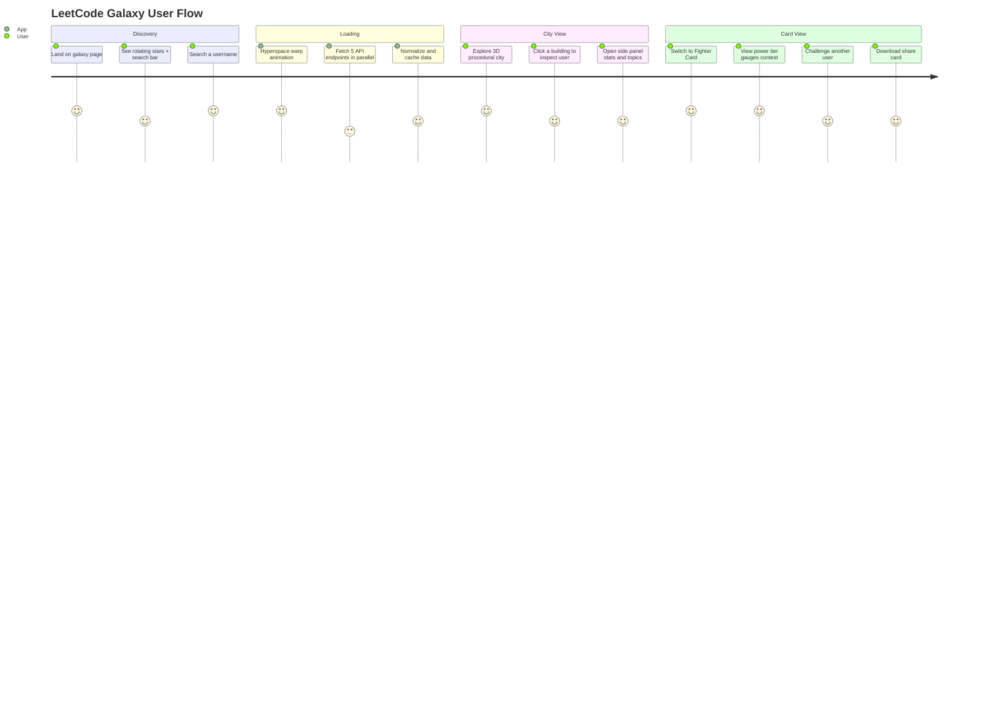
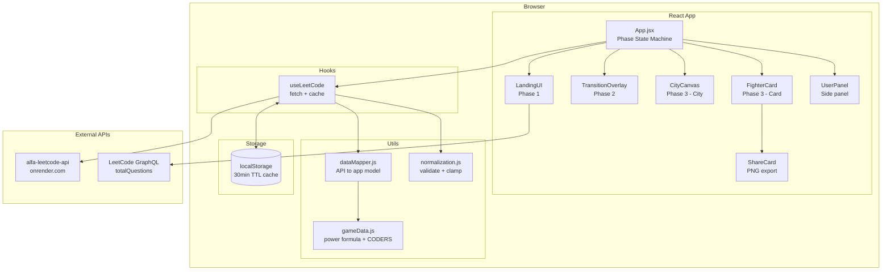
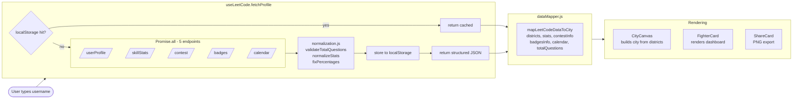
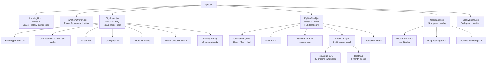
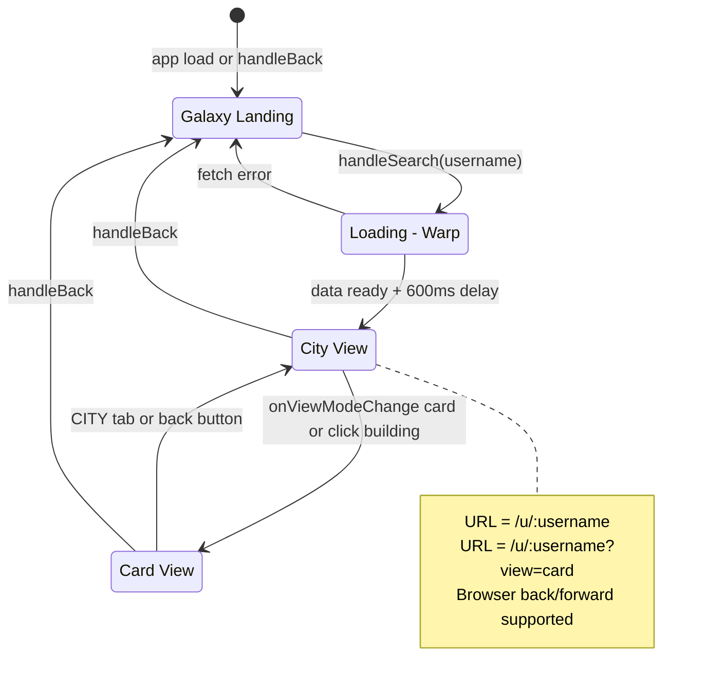
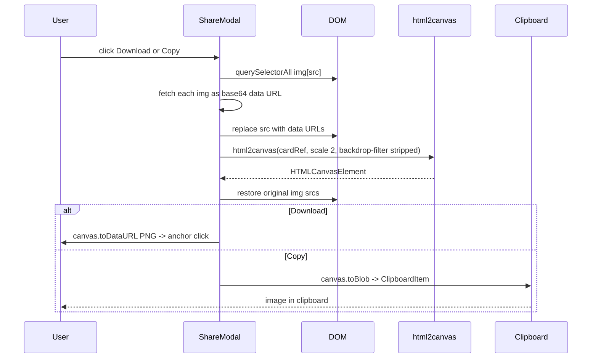

# 🌌 LeetCode Galaxy

> **A cinematic 3D platform that transforms any LeetCode profile into an explorable cyberpunk city.**

Search a username → warp through hyperspace → land in a procedurally generated city where every building is a coder, every district is a topic, and your stats become a battle card.

---

## Table of Contents

1. [Product Overview](#product-overview)
2. [User Journey](#user-journey)
3. [System Architecture](#system-architecture)
4. [Data Flow](#data-flow)
5. [Component Map](#component-map)
6. [API Integration](#api-integration)
7. [State Machine](#state-machine)
8. [Key Modules](#key-modules)
9. [Performance & Patterns](#performance--patterns)
10. [Known Issues & Dead Code](#known-issues--dead-code)
11. [Actionable Next Steps](#actionable-next-steps)
12. [Quick Start](#quick-start)

---

## Product Overview

| Layer | Tech |
|---|---|
| Framework | React 19 + Vite |
| 3D Engine | React Three Fiber + Three.js |
| Animation | Framer Motion |
| Audio | Web Audio API (procedural synthesis — zero external files) |
| Styling | Inline CSS-in-JS |
| Data | `alfa-leetcode-api.onrender.com` (free Render tier) |
| Export | `html2canvas` (PNG share card) |
| Routing | History API (`/u/:username?view=card\|city`) |
| Cache | localStorage (30 min TTL, versioned) |

### Core Value Proposition

LeetCode Galaxy makes coding stats **visual, social, and gamified**:

- 🏙️ **City View** — 3D procedural city; building height = problems solved
- ⚔️ **Fighter Card** — full-screen dashboard with power tiers, gauges, challenge mode
- 🃏 **Share Card** — premium LinkedIn-ready PNG card (glassmorphism, hex badge, heatmap)
- 🎮 **Challenge Mode** — VS battle between two users by power score
- 🌌 **Galaxy Landing** — interactive star field, Interstellar easter eggs

---

## User Journey



---

## System Architecture



---

## Data Flow



---

## Component Map



---

## API Integration

### Endpoints (`alfa-leetcode-api.onrender.com`)

| Endpoint | Data |
|---|---|
| `GET /userProfile/:user` | stats, ranking, reputation, recent submissions |
| `GET /skillStats/:user` | topic tags by difficulty tier |
| `GET /:user/contest` | rating, globalRanking, topPercentage, attended |
| `GET /:user/badges` | badge list with icons, displayNames |
| `GET /:user/calendar` | submissionCalendar (timestamp → count map) |

### Reliability Strategy

```mermaid
flowchart TD
    REQ[fetch request] --> TIMEOUT{AbortSignal 12s timeout}
    TIMEOUT -->|ok| OK[return response]
    TIMEOUT -->|timeout or error| RETRY{retries left?}
    RETRY -->|yes| WAIT[wait 300ms] --> REQ
    RETRY -->|no| FAIL[return empty object]
    FAIL --> SAFE[safeFetch returns {} instead of throw]
    SAFE --> PARALLEL[Promise.all continues with other endpoints]
```

Single failed endpoint returns `{}` — other 4 endpoints still succeed. `prewarmApi()` fires on mount to wake the Render cold-start before first search.

---

## State Machine



---

## Key Modules

### Power Formula (`gameData.js`)

```
Power = (easy × 1) + (medium × 3) + (hard × 10)
```

| Tier | Range | Color |
|---|---|---|
| EXPLORER | 0 – 300 | #94a3b8 |
| SPACE CADET | 300 – 800 | #fb923c |
| LAZARUS CREW | 800 – 1500 | #60a5fa |
| RANGER PILOT | 1500 – 3000 | #00f5d4 |
| ENDURANCE CAPTAIN | 3000 – 5000 | #a78bfa |
| HAIL MARY HERO | 5000 – 8000 | #fbbf24 |

### Share Card Export Pipeline



**Why pre-convert**: `allowTaint: true` taints canvas → `toDataURL()` throws SecurityError. Pre-converting to data URLs keeps canvas clean. `backdrop-filter` stripped via `onclone` because html2canvas v1 silently fails on it.

### Web Audio Synthesis (`useSpaceSound.js`)

Zero external audio files. All sound generated via `AudioContext`:

| Function | Trigger | Synthesis |
|---|---|---|
| `playDrone()` | Search start | D/A/D/F# chord stack + tremolo LFO, 4.5s |
| `playWarpSweep()` | Data loading | 80→1200Hz sawtooth + C5–E6 arpeggio |
| `playArrivalChord()` | City appears | Dmaj7 swell + D6 shimmer overtone |
| `startCityAmbient()` | City active | Organ drone + comb delays (cathedral reverb) |

> ⚠️ All sound calls stripped from App.jsx in current build. Module exists but disconnected — likely intentional UX decision.

---

## Performance & Patterns

| Pattern | Location | Effect |
|---|---|---|
| `useMemo` for roster | App.jsx, CityScene | No re-computation on unrelated renders |
| Canvas star field | FighterCard, LandingUI | 470 stars drawn once; zero ongoing rAF |
| Seeded RNG | CityScene | Deterministic buildings without state |
| localStorage cache | useLeetCode | 30-min TTL; avoids repeat API hits |
| `Promise.all` fetch | useLeetCode | 5 endpoints parallel, not sequential |
| API pre-warm | App mount | Wakes cold Render before first search |
| `AbortSignal.timeout(12000)` | fetchWithRetry | Hard 12s limit per endpoint |
| `onclone` CSS strip | ShareCard | Removes `backdrop-filter` before canvas capture |
| Reduced transition | App.jsx | 1800ms → 600ms post-fetch wait |

---

## Project Structure

```
leetcode-galaxy/
├── src/
│   ├── App.jsx                    # Phase state machine, routing, transitions
│   ├── components/
│   │   ├── LandingUI.jsx          # Galaxy landing, search, easter eggs
│   │   ├── GalaxyScene.jsx        # Three.js star field + nebula
│   │   ├── TransitionOverlay.jsx  # Warp animation overlay
│   │   ├── CityScene.jsx          # 3D city — buildings, cars, aurora, bloom
│   │   ├── UserPanel.jsx          # Side stats panel, radar chart, tabs
│   │   ├── FighterCard.jsx        # Full-screen dashboard
│   │   ├── ShareCard.jsx          # PNG export modal + card view
│   │   ├── Dashboard.jsx          # ⚠️ UNUSED — alternative card view
│   │   ├── FighterPanel.jsx       # ⚠️ UNUSED — slide-in panel
│   │   └── Arena.jsx              # ⚠️ UNUSED
│   ├── hooks/
│   │   ├── useLeetCode.js         # API fetch + localStorage cache
│   │   └── useSpaceSound.js       # ⚠️ DISCONNECTED — Web Audio synthesis
│   └── utils/
│       ├── dataMapper.js          # Raw API → normalized app model
│       ├── gameData.js            # Power formula, tier system, CODERS dataset
│       ├── normalization.js       # Validate + clamp stat counts
│       └── colors.js              # Shared color constants
├── public/
├── index.html
├── vite.config.js
└── package.json
```

---

## Known Issues & Dead Code

| Item | Type | Impact |
|---|---|---|
| `Dashboard.jsx` | Dead component | Bundle bloat, confusion |
| `FighterPanel.jsx` | Dead component | Bundle bloat |
| `Arena.jsx` | Dead component | Bundle bloat |
| `useSpaceSound.js` | Disconnected hook | ~10KB dead code in bundle |
| `isNight` state | Dead setter | `const [isNight] = useState(true)` — hardcoded forever |
| Badge CORS on export | Bug | LeetCode CDN badge images may fail CORS during PNG capture |
| No error boundary | Risk | API failure can crash entire render tree |
| Mobile FighterCard | Gap | FighterCard not responsive; UserPanel is |
| Easter eggs hardcoded | Scalability | 5 special usernames; no extensibility mechanism |
| Render cold start | UX | Free tier; first search ~10–30s if pre-warm misses |
| Sound regression | UX | Web Audio synthesizer exists but all call sites removed |

---

## Actionable Next Steps

### 🏗️ Architecture

- [ ] **Replace free Render API with self-hosted proxy** — eliminate cold-start; add rate limiting + auth
- [ ] **Add React Error Boundary** — graceful fallback when 3D or API fails
- [ ] **Introduce React Router** — replace manual History API push/popstate
- [ ] **Cache invalidation** — let users force-refresh without waiting 30 min TTL

### 🛠️ Developer

- [ ] **Delete dead files** — `Dashboard.jsx`, `FighterPanel.jsx`, `Arena.jsx`, `useSpaceSound.js`
- [ ] **Mobile pass for FighterCard** — currently unresponsive on small screens
- [ ] **Shared constants file** — difficulty colors and fallback question totals duplicated across 4+ files
- [ ] **Add tests** — zero test coverage; start with `normalization.js` and `gameData.js` (pure functions)
- [ ] **Badge image proxy** — serve LeetCode badge images through own endpoint to fix CORS on export

### 🎯 Product

- [ ] **OG image generation** — server-side share card render for social link previews
- [ ] **Multi-user city** — render several searched users' cities simultaneously
- [ ] **Leaderboard mode** — compare a list of users by power score
- [ ] **LeetCode OAuth** — auto-load authenticated user's profile
- [ ] **Re-enable sound** — the Web Audio synthesizer is high quality; disconnection appears unintentional

### ❓ Open Questions

1. **API dependency** — `alfa-leetcode-api` is community-maintained. What's the fallback plan if it goes down?
2. **Question count accuracy** — fallback constants (`LC_EASY_FB = 900`, `LC_MED_FB = 1900`) go stale. Auto-fetch from LeetCode GraphQL instead?
3. **Sound removal** — intentional or regression? `useSpaceSound.js` has high-quality synthesis; worth reconnecting.
4. **Mobile strategy** — is mobile a target platform? Current experience is desktop-first.
5. **Monetization** — premium share card (no watermark), custom city themes, private leaderboards?

---

## Quick Start

```bash
npm install
npm run dev        # → http://localhost:5173
npm run build      # → dist/
npm run preview    # preview production build
npm run lint       # ESLint
```

No `.env` required — all API calls go to public endpoints.

---

*Last updated: April 2026*
